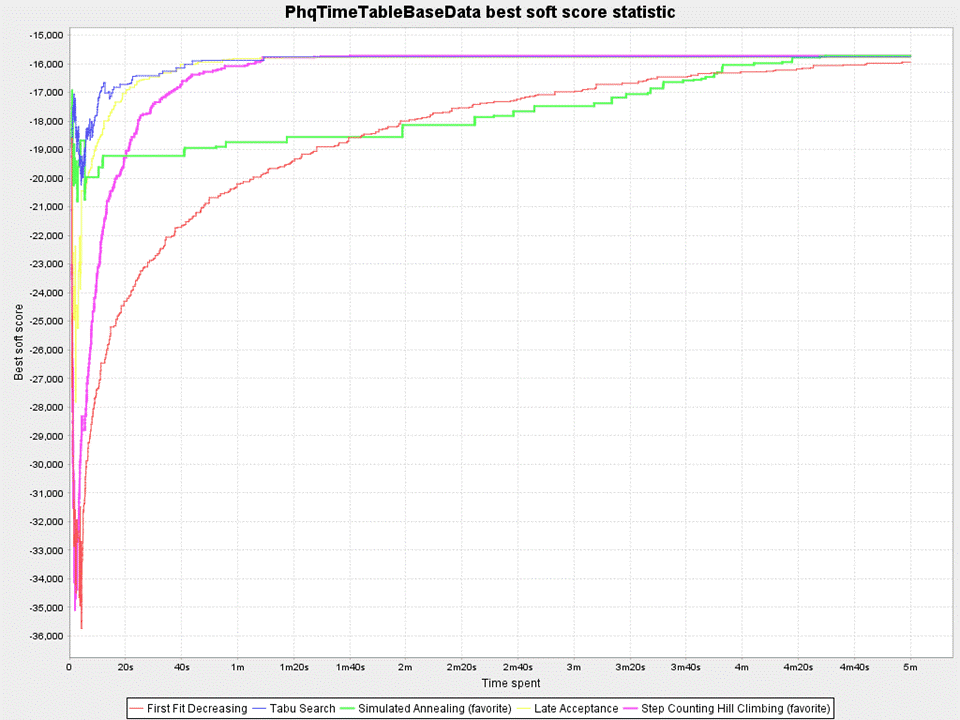

## SECTION 1 : PROJECT TITLE
## Patient Matching System

---
## SECTION 2 : EXECUTIVE SUMMARY / PAPER ABSTRACT
This project is a continuation from the Depression Screening System group project completed during the Machine Reasoning course. As a recap, the Depression Screening System deals with the problem of depression in youths and vulnerable segments of the community going undetected and untreated. It serves as an early warning system to put a spotlight on those vulnerable individuals who are displaying symptoms of depression. These vulnerable individuals can be spotted through the PHQ-9 Survey framework devised with the Depression Screening System. The output from that system is to provide a diagnosis (with a PHQ-9 score) on the level of severity of depression the individuals are having.
In this phase of project, the objective is to use the PHQ-9 scores of the individuals and match them to the many practitioners in the community partners, hospitals and IMH. 
Why Patient Matching? When we churn out a list of patients in batches as part of the PHQ-9 Survey, there is also a need to do the matching with practitioners in batches. There are some challenges to match patients to practitioners. First of all, practitioners fall into roughly 3 categories – Counsellors, Psychologists, Psychiatrists. Then there is the time availability of the practitioners, as well as language ability, which are all hard constraints. Also there is location preference and gender preference which are soft constraints. Then there is the cost based on the practitioner selected, which is a soft constraint to minimize it.
Using the State Space Search techniques embedded in the OptaPlanner, the Patient Matching System is able to optimally match a group of patients against a group of practitioners. The detail of how this match is executed will be covered in the next chapters.
This system provides benefits to those who are diagnosed with depression by matching appropriate practitioners with the right expertise and in accordance to some set constraints.

---
## SECTION 3 : CREDITS / PROJECT CONTRIBUTION

| Official Full Name  | Student ID (MTech Applicable)  | Work Items (Who Did What) | Email (Optional) |
| :------------ |:---------------:| :-----| :-----|
| CAO LIANG            | A0012884E | Architect, Application Logic, DROOLS Rules and Integration     | A0012884E@nus.edu.sg |
| GENG LIANGYU         | A0195278M | Web Application and Landing Page                               | A0195278M@nus.edu.sg |
| HAN DONGCHOU FRANCIS | A0195414A | Team Lead, Documentation, and Submission                       | A0195414A@nus.edu.sg |
| ONG BOON PING        | A0195172B | KIE Workflow and Data Structure                                | A0195172B@nus.edu.sg |
| TAN CHIN GEE         | A0195296M | Domain Expert and Documentation                                | A0195296M@nus.edu.sg |

---
## SECTION 4 : VIDEO OF SYSTEM MODELLING & USE CASE DEMO

[Introduction Video](https://youtu.be/RXYVsCB5vHU)

---
## SECTION 5 : USER GUIDE

`<Github File Link>` : <https://github.com/francis-han/Group-Project/blob/master/UserGuide/Users%20Manual.pdf>

### [ 1 ] To run the system in windows or iss-vm

> $ git clone https://github.com/francis-han/IRS-MR-2019-07-01-IS1PT-GRP-Pepper-DepressionScreeningSystem.git

> go to /SystemCodes/Submission/, unzip IRS-MR-2019-01-19-IS1PT-GRP-Depression_Screening_System.zip and get the mr-phq9-0.1.0.jar.

> open CMD window, go to the folder which contains the jar file, eg: cd C:\Users\cl\Documents\GitHub\Group-Project\SystemCodes\

> run command: java -jar mr-phq9-0.1.0.jar

> **Go to URL using web browser** http://127.0.0.1:8090 or http://0.0.0.0:8090 

---
## SECTION 6 : PROJECT REPORT / PAPER

`<Github File Link>` : <https://github.com/francis-han/Group-Project/blob/master/Project%20Report/Project%20Report5.pdf>

**Recommended Sections for Project Report / Paper:**
- Executive Summary / Paper Abstract
- Sponsor Company Introduction (if applicable)
- Business Problem Background
- Project Objectives & Success Measurements
- Project Solution (To detail domain modelling & system design.)
- Project Implementation (To detail system development & testing approach.)
- Project Performance & Validation (To prove project objectives are met.)
- Project Conclusions: Findings & Recommendation
- List of Abbreviations (if applicable)
- References (if applicable)

---
## SECTION 7 : MISCELLANEOUS

### COMPARISON OF DIFFERENT SEARCH TECHNIQUES

Explanation......

